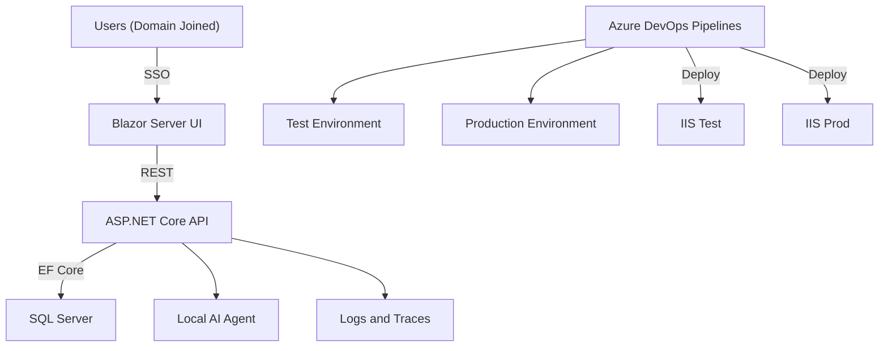

# Future State System Specification (v4)

**Author:** Michael Bender  
**Stack:** Microsoft Full Stack (Blazor, .NET 8, EF Core, SQL Server, Azure DevOps, IIS, Containers, Local AI)  
**Date:** January 2026 

---

## 1. Vision Statement
Create a fully integrated Microsoft-based application platform for internal business systems, enabling rapid deployment, maintainability, and AI-assisted automation. The solution will modernize legacy applications into secure, web-based applications hosted on Windows Server using IIS, backed by CI/CD pipelines in Azure DevOps and enhanced by a local AI agent. Containerization is supported, but treated as an optimization step (not a prerequisite) to avoid unnecessary complexity early.

---

## 2. System Overview
### Core Components
| Layer | Technology | Purpose |
|--------|-------------|----------|
| **Frontend** | **Blazor Server (.NET 8)** | Intranet web UI with Windows SSO and server-side execution. Prioritized for intranet/LAN environments where latency is low and connection stability high; user counts typically support this model in enterprise internal applications. |
| **Backend API** | **ASP.NET Core REST API (Minimal APIs or Controllers)** | Stable HTTP API contract to keep the UI replaceable. |
| **Database** | **SQL Server 2022** | Centralized, relational data store. |
| **ORM** | **Entity Framework Core 8** | Data access and migration management. |
| **Auth** | **Windows Authentication (Active Directory / Negotiate)** | Domain-joined SSO with AD-group-based authorization policies. |
| **Web Server** | **IIS on Windows Server 2022** | Hosting environment for apps and APIs (containers optional). |
| **DevOps** | **Azure DevOps Pipelines + Repos** | Source control, build, deploy on merge to main/test. |
| **Observability** | **Serilog + OpenTelemetry (recommended)** | Structured logs and traces to enable rapid debugging and AI-assisted triage. |
| **AI Layer** | **Local Llama Model (via Ollama / LM Studio)** | Embedded AI assistant for code, testing, and operations. |
| **Containers (Optional)** | **Docker + Compose (Windows containers)** | Standardized app environments and portability (adopt after the baseline is stable). |

### Architectural Principles (Non-Goals: avoid unnecessary complexity)
- **API-first:** Business rules live in the REST API so the frontend can change over time.
- **SSO-first:** Domain-joined users authenticate via Windows Integrated Authentication.
- **Monolith-first:** The platform uses a modular monolith approach; microservices and distributed systems are explicitly deferred until organizational scale or operational requirements justify the added complexity.
- **Minimum viable platform:** Standardize templates, logging, and CI/CD before adding containers, service meshes, or complex orchestration.

---

## 3. Architecture Diagram



---

## 4. Security Model
- **Authentication:** Windows Authentication via Active Directory (IIS + ASP.NET Core `Negotiate` / Windows Integrated Auth).  
- **Authorization:** Policy-based authorization driven by AD groups (managed by helpdesk/security).  
- **Environment Segregation:** Separate Test and Production environments with separate app pools/service accounts (container separation optional).  
- **Pipeline Security:** Protected branches and PR approvals; deployment approvals for Production.  
- **Secrets:** Stored outside source control (e.g., IIS config + secure secret store); never exposed to the AI layer.  
- **AI Access Control:** AI agent restricted to approved code directories, runbooks, and sanitized logs/traces only.

---

## 5. Out of Scope (Intentional Non-Goals)
The following are explicitly **not** in scope for this platform and are deferred pending clear operational or scale justification:

- **Kubernetes-first or container-native orchestration:** Containers are deployment tools, not architectural requirements; IIS on Windows Server is the production target.
- **Internet-facing or public-access architecture:** This is an intranet-only platform; no DMZ, zero-trust, or external API exposure is planned.
- **Autonomous or self-modifying AI:** AI functions are advisory and read-only; code and infrastructure changes remain human-approved and logged.
- **AI access to secrets, credentials, or raw sensitive data:** AI receives sanitized logs, traces, source code, and runbooks only; connection strings and API keys remain protected outside the AI layer.
- **Event-driven microservices or service mesh:** Complexity reserved for later phases; initial messaging is handled via direct API calls and database events (if needed).

These non-goals reduce risk and operational overhead during the initial rollout phases.

---

## 6. Deployment Workflow
| Stage | Trigger | Action | Target |
|--------|----------|---------|---------|
| **Dev** | Local Build | Developer runs locally | Local IIS Express / Kestrel |
| **Test (CI)** | On every commit/PR | Run unit + integration tests, fail build if coverage drops below targets | Azure DevOps hosted agent |
| **Test** | Merge to `test` branch | Azure DevOps builds & deploys to Test | Test Server (IIS) |
| **Prod** | Merge + Approve PR to `main` | Azure DevOps deploys after approval | Production Server (IIS) |

Each deployment includes:  
- Unit + Integration Tests (xUnit / MSTest)  
- Publish build artifacts (API + UI)  
- Deploy to IIS (Web Deploy / artifact copy + app pool recycle)  
- Structured logging + correlation IDs for triage  
- Log aggregation & notification (optional PowerShell / Teams integration)

### CI/CD Notes (YAML)
- CI/CD is defined using Azure DevOps **YAML pipelines** (build + deployment). The intent is repeatable deployments to Test/Prod with minimal manual steps.
- Recommendation: keep the API and UI build as separate jobs and deploy them as separate artifacts, even if hosted on the same server.

### 6.1. Database Migration Strategy

#### EF Core Migration Workflow
1. **Developers create migrations locally** using `dotnet ef migrations add <MigrationName>` when modifying the EF Core data model.
2. **Migrations are committed to source control** alongside code changes (`.cs` migration files in the `Migrations/` folder).
3. **CI/CD pipeline validates migrations** can be applied cleanly before deployment by running `dotnet ef migrations bundle --self-contained` and verifying the bundle builds successfully.

#### Deployment-Time Migration Application
1. **Test Environment:** Migrations are applied **automatically** during deployment via EF Core Migration Bundles (`efbundle.exe`). The deployment pipeline executes the bundle as part of the release process.
2. **Production Environment:** Migrations are **reviewed during PR approval** to assess risk (e.g., schema changes, data loss potential). The bundle is executed in the deployment pipeline **after** an approval gate and only after a pre-deployment database backup completes.
3. **Always take a database backup** before applying migrations in Production. Use SQL Server backup jobs or inline YAML steps to capture the backup and verify success before proceeding.

#### Rollback Procedures
| Scenario | Action |
|----------|--------|
| **Code rollback only (no schema changes)** | Redeploy previous IIS artifacts from Azure DevOps; database remains at current schema version. |
| **Schema change rollback (breaking change)** | Restore database from pre-deployment backup, then redeploy previous code version to match the restored schema. |
| **Failed migration (partial apply)** | **Stop deployment immediately.** Restore database from backup. Investigate migration failure offline before reattempting. Do not proceed to Production. |

#### Migration Reversibility (Down Migrations)
- EF Core generates both **Up** (apply) and **Down** (rollback) migrations by default. Maintain these in source control for local development reversibility.
- **Production rollback via Down migrations is risky** (data loss, incomplete rollback). Always prefer **database backup restoration** for Production rollbacks rather than running `Down()` methods.
- Down migrations are useful for local development iteration but should not be relied upon in Production scenarios.

### 6.2. Rollback Procedures

#### Pre-Deployment Preparation Checklist
Before deploying to Production, ensure the following are in place to enable rapid rollback if necessary:

- [ ] **Verify database backup completed successfully** (automated in pipeline; check backup completion status before proceeding).
- [ ] **Document current deployed version numbers** for API, UI, and database schema version (store in deployment notes or Azure DevOps release).
- [ ] **Ensure previous deployment artifacts are retained** in Azure DevOps (minimum 5 releases retained per retention policy).
- [ ] **Confirm health check endpoint** is operational and returns expected status before deployment begins.

#### Rollback Decision Matrix
| Issue Severity | Time to Detect | Action |
|----------------|----------------|--------|
| **Critical (application down, data loss, security breach)** | < 5 minutes | **Immediate rollback** to previous version. No investigation; restore service first. |
| **Major (feature broken, significant user impact)** | < 30 minutes | **Rollback if no quick fix available.** Attempt rapid fix only if root cause is obvious and fix can be deployed in < 15 minutes. |
| **Minor (cosmetic issue, non-critical bug)** | Any time | **Fix forward in next deployment.** Do not rollback; log issue and schedule fix in upcoming sprint. |

#### IIS Rollback Procedure
Follow these steps to rollback an IIS-hosted application to the previous deployment:

1. **Stop the affected IIS application pool** via IIS Manager or PowerShell: `Stop-WebAppPool -Name "AppPoolName"`.
2. **Restore previous deployment artifacts** from Azure DevOps release (download artifacts or trigger redeploy of previous release).
3. **Update web.config** if configuration values changed between versions (connection strings, app settings).
4. **Restart the IIS application pool**: `Start-WebAppPool -Name "AppPoolName"`.
5. **Verify health check endpoint** responds successfully (e.g., `https://appname/health` returns HTTP 200).
6. **If database schema changed:** Restore database from pre-deployment backup before restarting the application pool (see Database Migration Strategy rollback procedures).

#### Automated Rollback Capabilities
- **Azure DevOps redeploy:** Azure DevOps supports one-click redeploy of any previous release via the Releases UI. Navigate to the target environment, select a previous successful release, and click "Redeploy."
- **PowerShell artifact swap example:**

```powershell
# Example: Automated IIS artifact swap script
$appPoolName = "MyAppPool"
$sitePath = "C:\inetpub\wwwroot\MyApp"
$backupPath = "C:\Deployments\Backups\MyApp_v1.2.3"

Stop-WebAppPool -Name $appPoolName
Remove-Item "$sitePath\*" -Recurse -Force
Copy-Item "$backupPath\*" -Destination $sitePath -Recurse
Start-WebAppPool -Name $appPoolName
Write-Host "Rollback complete. Verify health check."
```

- **Database rollback approval:** Database rollbacks require manual approval due to data loss risk. Automated rollback scripts should **stop and alert** before restoring a database backup, requiring operator confirmation.

#### Post-Rollback Actions
After a rollback is executed, complete the following within the specified timeframes:

1. **Update incident log** with root cause summary, rollback timestamp, and impacted users (within 1 hour).
2. **Schedule post-mortem meeting** within 48 hours; include development, QA, and operations stakeholders.
3. **Create work item** to address the underlying issue that caused the rollback; prioritize based on severity.
4. **Review deployment process** for gaps in testing or approval gates that allowed the issue to reach Production.

---

## 7. Local AI Agent (Llama)
### Goals
- Review C#, SQL, and Blazor code for errors and improvements.
- Propose tests and data validations.
- Summarize helpdesk tickets and automate updates.

### Operational Outcomes
- **Reduced MTTR:** Faster root-cause analysis of build and deployment failures via correlation IDs and structured log summarization.
- **Accelerated debugging:** AI-assisted triage reduces manual log parsing and speeds handoff between developers and support.
- **Improved onboarding:** New developers can query the AI for project structure, recent changes, and common runbooks without blocking senior engineers.
- **Helpdesk workload reduction:** Ticket summarization and status automation reduce manual administrative overhead.

### Technical Architecture
| Component | Description |
|------------|--------------|
| **Ollama / LM Studio** | Runs Llama 3 locally with API access. |
| **AI Connector API** | .NET service connecting to local AI endpoint. |
| **Knowledge Base** | Uses vectorized project data and DevOps logs. |
| **Usage Examples** | “Summarize last 10 commits”, “Review recent build logs for errors.” |
### 7.3. Knowledge Base Maintenance

#### Knowledge Base Refresh Strategy
Vector embeddings are regenerated when code or documentation changes to ensure the AI agent has current information for code review and triage.

1. **Automatic regeneration** is triggered on merge to the `main` branch via an Azure DevOps pipeline task.
2. **Incremental updates** are used for performance: only files modified since the last embedding run are re-embedded (based on git diff).
3. **Initial embedding generation** takes 15-30 minutes for a full codebase; incremental updates complete in 2-5 minutes.

#### Information Sources
| Source | Update Frequency | Purpose |
|--------|------------------|---------|
| **Source code (C#, Blazor, SQL)** | On commit to main | Code review, pattern analysis, and answering "where is X implemented?" |
| **API contracts (OpenAPI/Swagger)** | On API schema changes | Contract understanding and breaking change detection |
| **Build/deploy logs** | Real-time | Failure triage and root cause analysis for CI/CD issues |
| **Application logs/traces** | Real-time stream | Runtime issue diagnosis, correlation ID-based debugging |
| **Runbooks/documentation** | Weekly | Operational guidance, onboarding support, and procedural questions |

#### Storage and Indexing Approach
- **Local vector database:** Use ChromaDB (or similar lightweight vector store) hosted on the AI server alongside Ollama/LM Studio.
- **Separate collections:** Maintain distinct collections for code artifacts vs. operational data (logs/traces) to optimize query performance and relevance.
- **Retention policy:** Keep the last 90 days of logs and traces; retain all code and documentation from the `main` branch indefinitely (archive older branches as needed).

#### Performance Considerations
- Initial embedding generation for a new repository takes **15-30 minutes** depending on codebase size.
- Incremental updates (triggered by new commits) complete in **2-5 minutes** and run asynchronously without blocking deployments.
- Query performance is optimized by separating code embeddings from operational log embeddings (different query patterns).
### Information Strategy (to keep AI useful, not risky)
- Primary inputs: source code, API contracts (OpenAPI), build/deploy logs, structured application logs, traces, and runbooks.
- Exclusions by default: secrets, connection strings, raw database data containing sensitive information.
- Goal: the AI agent can answer “what changed / what failed / where to look next” using correlation IDs, logs, and traces.

---
## 7.5. Performance and Monitoring Baseline

**Note:** Performance baselines should be established in Phase 1 (Core Infrastructure), not retroactively added later. Early baseline measurement enables accurate detection of regressions throughout the application lifecycle.

### Performance Targets
| Metric | Target | Measurement Method |
|--------|--------|-------------------|
| **API Response Time (p95)** | < 200ms | Application Insights / OpenTelemetry traces |
| **Page Load Time (Blazor Server)** | < 1.5s | Browser DevTools / Real User Monitoring (RUM) |
| **Database Query Time (p95)** | < 100ms | EF Core logging + SQL Server Query Store |
| **Memory Usage (API)** | < 512MB per instance | Performance counters / Container metrics (if applicable) |
| **Concurrent Users** | 100+ simultaneous | Load testing (JMeter or k6) |

### Baseline Establishment Process
1. **Measure performance during Phase 1** using synthetic load tests against the reference application in the Test environment.
2. **Record baseline metrics** in project documentation (e.g., Azure DevOps wiki or repository README). Include test conditions (load profile, data volume, infrastructure specs).
3. **Set up Azure DevOps dashboards** to track performance trends over time using Azure Boards widgets or custom Power BI reports.
4. **Configure alerts** to trigger when metrics degrade by 20% or more from the established baseline (e.g., p95 response time exceeds 240ms).

### Monitoring Implementation
- **Serilog with structured logging:** Instrument the application to emit structured logs containing performance metrics (request duration, query execution time, memory usage).
- **OpenTelemetry exporter:** Export traces and metrics to an OpenTelemetry collector for centralized aggregation and analysis.
- **Metric storage:** Store metrics in SQL Server (for integration with existing infrastructure) or a lightweight time-series database (e.g., InfluxDB if dedicated performance monitoring is required).
- **Dashboards (optional):** Create Grafana or Power BI dashboards for real-time visualization of performance trends. Grafana is recommended for operational monitoring; Power BI for executive reporting.

### Performance Regression Detection in CI/CD
To prevent performance degradation from reaching Production:

1. **Run automated load tests** in the Test environment as part of the deployment pipeline (before Production deployment).
2. **Compare test results** against the established baseline metrics (store baseline in Azure DevOps variable group or configuration file).
3. **Block deployment** if performance degrades by more than 30% compared to baseline (e.g., p95 response time exceeds 260ms). Require manual approval and investigation before proceeding.
4. **Log regression details** to Azure DevOps build summary for post-deployment review and trend analysis.

### Capacity Planning Triggers
- **Quarterly metric review:** Schedule a quarterly review of performance metrics with development and operations teams to assess trends and identify optimization opportunities.
- **Infrastructure upgrade planning:** Plan infrastructure upgrades (additional IIS servers, database scaling, memory increases) when metrics consistently exceed 70% of target thresholds (e.g., p95 response time consistently > 140ms).
- **Historical trend analysis:** Use historical performance data to predict scaling needs before user impact occurs (e.g., if response time increases 10% per quarter, plan upgrades proactively).

---
## 8. Roadmap (Implementation Plan)
| Phase | Goal | Key Deliverables |
|--------|------|------------------|
| **Phase 1** | Core Infrastructure (Minimal Platform) | IIS hosting, Windows Auth, API-first templates, YAML CI/CD, baseline structured logging |
| **Phase 2** | First App Migration | Migrate first legacy app → Blazor Server UI + REST API + EF Core + SQL |
| **Phase 3** | AI Layer | Install Llama/Ollama, connect via .NET service, ingest logs/traces/runbooks |
| **Phase 4** | Monitoring & Enhancements | Central logging/tracing, backups, runbooks, AI-assisted triage workflows |
| **Phase 5** | Expansion | Repeat migrations, retire apps replaced by COTS, optional containerization where it provides clear value |

---

## 8.5. Testing Strategy

### Testing Levels
| Level | Coverage Target | Tools | Responsibility | Execution Frequency |
|-------|----------------|-------|----------------|---------------------|
| **Unit Tests** | 70% code coverage | xUnit / MSTest | Developer (write tests alongside feature code) | Every commit / local build |
| **Integration Tests** | 80% coverage of critical API paths | WebApplicationFactory + xUnit | Developer / QA | CI pipeline + pre-deployment |
| **E2E Tests** | Critical user workflows only | Playwright for Blazor | QA / Automation Engineer | Test environment before Prod deployment |

### API Contract Testing
API contract tests verify that REST API responses conform to the published OpenAPI specification, ensuring the Blazor UI and other consumers are not broken by backend changes.

**Implementation:**
- Use `WebApplicationFactory<TEntryPoint>` to spin up the API in-memory during integration tests.
- Validate response structure, status codes, and schema against the OpenAPI spec.
- Run contract tests in the CI pipeline **before** deployment artifacts are published.
- Fail the build if contract violations are detected (prevents breaking changes from reaching Test or Prod).

**Goal:** Prevent accidental breaking changes to API contracts that would impact Blazor Server UI dependencies or future API consumers.

### Test Data Management
To ensure reliable and repeatable testing without risking production data:

- **SQL Server Database Snapshots:** Use database snapshots or backup/restore for integration tests to start from a known-good state.
- **Separate Test Database per Environment:** Maintain dedicated test databases for Dev, Test, and CI environments; never share databases across environments.
- **No Production Data in Tests:** Integration and E2E tests must **never** run against Production databases. Use anonymized or synthetic data for test environments.
- **Data Seeding:** Use EF Core migrations or seed scripts to populate test databases with predictable data sets for repeatable test execution.

---

## 9. Training Roadmap (Free Hands-On Tutorials)
### 1. **Blazor (.NET 8)**
- [FreeCodeCamp: Build a Full Blazor WebAssembly App (YouTube)](https://www.youtube.com/watch?v=gfI0hFdY1p8)
- [Microsoft Learn: Build a Blazor WebAssembly App](https://learn.microsoft.com/en-us/training/modules/build-blazor-webassembly-visual-studio/)

Note: for this platform, prioritize **Blazor Server** training and patterns (Windows SSO in intranet environments).

### 2. **ASP.NET Core APIs + EF Core**
- [Code Maze: ASP.NET Core Web API + EF Core Tutorial](https://code-maze.com/aspnetcore-webapi-efcore/)
- [Microsoft Learn: Work with Data in EF Core](https://learn.microsoft.com/en-us/training/modules/persist-data-ef-core/)

### 3. **SQL Server + Docker Setup**
- [Microsoft Docs: SQL Server Containers on Windows](https://learn.microsoft.com/en-us/sql/linux/sql-server-linux-docker-container-deployment?view=sql-server-ver16)

### 4. **Azure DevOps Pipelines + CI/CD**
- [Microsoft Learn: Build ASP.NET Core Apps with Azure Pipelines](https://learn.microsoft.com/en-us/training/modules/build-app-with-pipelines/)
- [YouTube: DevOps CI/CD for ASP.NET Apps](https://www.youtube.com/watch?v=Rg2mA9ZuHhA)

### 5. **Docker on Windows + IIS Containers**
- [Microsoft Learn: Docker for .NET Developers](https://learn.microsoft.com/en-us/dotnet/architecture/microservices/container-docker-introduction/)
- [YouTube: Host ASP.NET in IIS using Docker](https://www.youtube.com/watch?v=2sXKq5f8DgI)

### 6. **AI Integration (Llama / Ollama)**
- [Ollama Setup Guide](https://ollama.ai/download)
- [Local Llama 3 API Example (GitHub)](https://github.com/ollama/ollama)
- [YouTube: Run Llama 3 Locally](https://www.youtube.com/watch?v=tVYgxFtYVbE)

---

## 10. Implementation Checklist
- [ ] Configure IIS + ASP.NET Core Hosting Bundle  
- [ ] Enable Windows Integrated Auth (Negotiate) for UI + API  
- [ ] Define AD group naming + map groups to app authorization policies  
- [ ] Create Azure DevOps repo + YAML pipeline templates (build + deploy)  
- [ ] Setup branch policy (dev/test/main + approval gates)  
- [ ] Create reference app: Blazor Server UI + REST API + EF Core + SQL  
- [ ] Add structured logging + correlation IDs (Serilog recommended)  
- [ ] Add health checks and a basic status endpoint  
- [ ] Centralize logs/traces for debugging and AI triage  
- [ ] Integrate local AI agent (read-only access to code + logs + runbooks)  
- [ ] Document AI feedback workflow

---

## 11. Next Steps
1. Finalize environment specs for your local test VM.  
2. Finalize the reference application template (Blazor Server UI + REST API + Windows Auth).  
3. Wire up your existing Azure DevOps YAML build/deploy pipelines to Test and Prod IIS servers.  
4. Add structured logging + correlation IDs early (so debugging and AI workflows are practical).  
5. Integrate AI agent for log/code review in Phase 3.

---

**End of Document**

