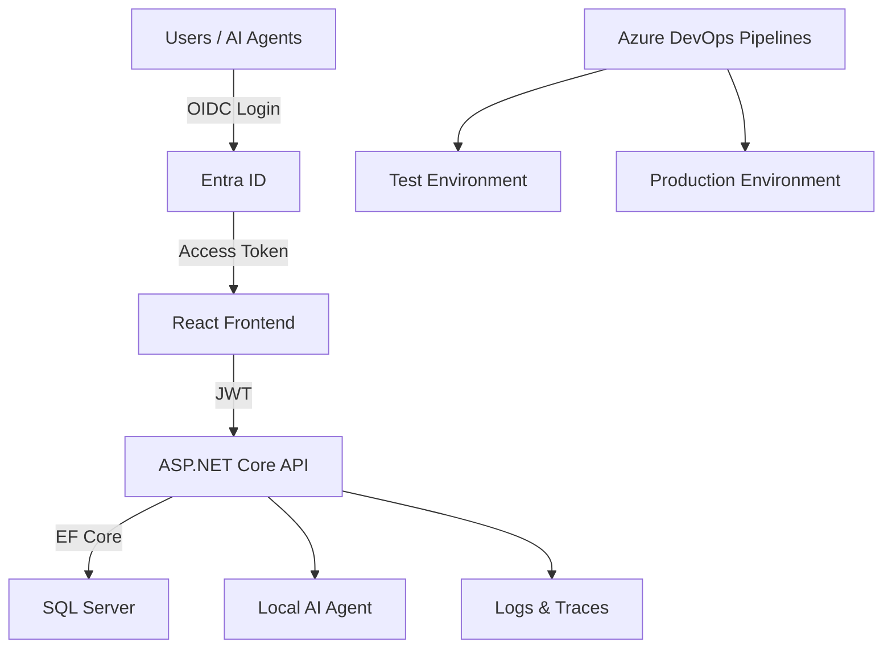

# Future State System Specification (v5)

**Author:** Michael Bender  
**Stack:** Microsoft Full Stack (React, TypeScript, .NET 8, EF Core, SQL Server, Azure DevOps, IIS / Azure App Service, Containers, Local AI)  
**Date:** January 2026

---

## 1. Vision Statement
Create a secure, modern, and reusable application platform for internal business systems that cleanly separates identity, authorization, and business logic. The platform modernizes legacy applications into API-first systems with a React-based frontend, a .NET backend, and AI-assisted automation. The architecture prioritizes simplicity, portability, and long-term reuse across internal enterprise scenarios and future external or SaaS-style deployments.

---

## 2. System Overview

### Core Components
| Layer | Technology | Purpose |
|------|-----------|---------|
| **Frontend** | **React + TypeScript (Vite or Next.js)** | Modern, decoupled UI layer. Optimized for long-term reuse, rich UX, and compatibility with AI-driven UI patterns. Hosted independently from the API. |
| **Backend API** | **ASP.NET Core (.NET 8) – Minimal APIs / Controllers** | API-first backend containing all business rules, authorization enforcement, and integrations. Frontend-agnostic by design. |
| **Database** | **SQL Server 2022** | Centralized relational data store. |
| **ORM** | **Entity Framework Core 8** | Data access, migrations, and schema management. |
| **Authentication** | **Microsoft Entra ID (Azure AD, OIDC/OAuth2)** | Central identity provider for employees, service principals, and AI agents. MFA and conditional access handled externally. |
| **Authorization** | **Application-managed roles & permissions** | Business authorization rules stored and enforced within the application (not AD group–driven). |
| **Hosting** | **IIS (Windows Server) or Azure App Service** | Flexible hosting model supporting both on-prem and cloud deployments. |
| **DevOps** | **Azure DevOps Pipelines + Repos** | CI/CD, branch policies, and deployment approvals. |
| **Observability** | **Serilog + OpenTelemetry** | Structured logs, metrics, and traces for debugging and AI-assisted triage. |
| **AI Layer** | **Local LLM (Ollama / LM Studio)** | Embedded AI agent for code review, log analysis, and operational assistance. |
| **Containers (Optional)** | **Docker + Compose** | Optional packaging and portability mechanism once the baseline platform is stable. |

### Architectural Principles
- **API-first:** All business logic and authorization live in the backend API.
- **Decoupled UI:** React frontend is fully replaceable without impacting backend logic.
- **Identity externalized:** Authentication is delegated to Entra ID; the application never manages credentials.
- **Authorization internalized:** Roles and permissions are owned by the application for portability and reuse.
- **Monolith-first:** Modular monolith architecture; microservices deferred until justified by scale.
- **Minimum viable platform:** Avoid premature complexity (Kubernetes, service mesh, distributed auth).

---

## 3. Architecture Diagram



---

## 4. Security Model

### Authentication (Who are you?)
- **Provider:** Microsoft Entra ID (Azure AD)
- **Protocol:** OAuth2 / OpenID Connect
- **Clients:**
  - React frontend (public client)
  - Backend API (resource server)
  - AI agent / automation (service principal)
- **Token Validation:** Performed by the ASP.NET Core API
- **Key Identifier:** Entra ID **Object ID (OID)** – immutable and globally unique

> Emails, UPNs, and display names are treated as informational only and never used as primary identifiers.

### Authorization (What can you do?)
- **Model:** Application-managed roles and permissions
- **Storage:** SQL Server
- **Enforcement:** Backend API only (never trusted to the frontend)

Example model:
```
User (ExternalUserId = Entra Object ID)
Role
Permission
UserRole
RolePermission
```

- AD groups may be used **only** for:
  - Initial bootstrap (e.g., first admin)
  - High-level super-admin access
- Business logic and workflow permissions never depend on AD group membership.

### AI Agent Security
- Authenticates using a **service principal**
- Assigned explicit application permissions
- Subject to the same authorization pipeline as human users
- Read-only access to code, logs, traces, and runbooks

---

## 5. Out of Scope (Intentional Non-Goals)
- AD group–driven business logic
- UI-based authorization enforcement
- Internet-facing / public access architecture (initial phase)
- Autonomous or self-modifying AI
- AI access to secrets or raw sensitive data
- Kubernetes-first or microservice-first design

---

## 6. Deployment Workflow
| Stage | Trigger | Action | Target |
|------|--------|--------|--------|
| **Dev** | Local build | Run React + API locally | Localhost / Kestrel |
| **CI** | PR / commit | Build, test, lint | Azure DevOps agent |
| **Test** | Merge to `test` | Deploy API + UI | Test environment |
| **Prod** | Merge + approval to `main` | Deploy after approval | Production |

- Frontend and API are built and deployed as **separate artifacts**.
- Previous releases are retained for rapid rollback.

---

## 7. Database Migration Strategy

- EF Core migrations created and committed with code changes
- CI validates migrations via migration bundles
- Test: migrations applied automatically
- Prod: migrations applied only after approval and verified database backup
- Production rollback uses **database restore**, not Down migrations

---

## 8. Local AI Agent

### Goals
- Review C#, SQL, and TypeScript code
- Analyze build and deployment failures
- Summarize logs and incidents
- Assist onboarding and operational triage

### Constraints
- Advisory only
- No write access to production systems
- No access to secrets or credentials

---

## 9. Performance & Monitoring Baseline

| Metric | Target |
|------|--------|
| API p95 response | < 200ms |
| Frontend load (p95) | < 1.5s |
| DB query p95 | < 100ms |
| Concurrent users | 100+ |

Baselines are established early and enforced via CI/CD gates.

---

## 10. Roadmap
| Phase | Goal |
|------|-----|
| Phase 1 | Core API, auth, CI/CD, logging |
| Phase 2 | First React-based app migration |
| Phase 3 | AI agent integration |
| Phase 4 | Monitoring & optimization |
| Phase 5 | Platform reuse and expansion |

---

## 11. Next Steps
1. Finalize Entra ID app registrations (UI, API, AI agent)
2. Define application role & permission schema
3. Update CI/CD pipelines for separate UI/API builds
4. Create reference React + .NET application template
5. Integrate AI agent with logs and code repositories

---

**End of Document**

