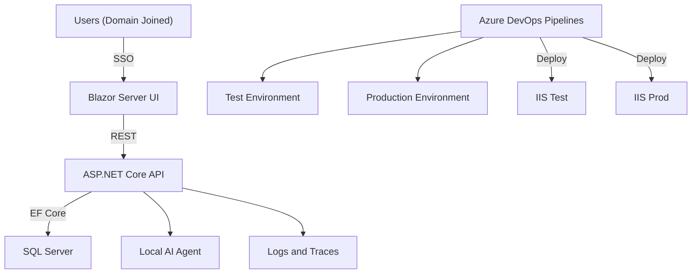

# Future State System Specification (v2)

**Author:** Mike Bender  
**Stack:** Microsoft Full Stack (Blazor, .NET 8, EF Core, SQL Server, Azure DevOps, IIS, Containers, Local AI)  
**Date:** October 2025  

---

## 1. Vision Statement
Create a fully integrated Microsoft-based application platform for internal business systems, enabling rapid deployment, maintainability, and AI-assisted automation. The solution will modernize legacy applications into secure, web-based applications hosted on Windows Server using IIS, backed by CI/CD pipelines in Azure DevOps and enhanced by a local AI agent. Containerization is supported, but treated as an optimization step (not a prerequisite) to avoid unnecessary complexity early.

---

## 2. System Overview
### Core Components
| Layer | Technology | Purpose |
|--------|-------------|----------|
| **Frontend** | **Blazor Server (.NET 8)** | Intranet web UI with Windows SSO and server-side execution. |
| **Backend API** | **ASP.NET Core REST API (Minimal APIs or Controllers)** | Stable HTTP API contract to keep the UI replaceable. |
| **Database** | **SQL Server 2022** | Centralized, relational data store. |
| **ORM** | **Entity Framework Core 8** | Data access and migration management. |
| **Auth** | **Windows Authentication (Active Directory / Negotiate)** | Domain-joined SSO with AD-group-based authorization policies. |
| **Web Server** | **IIS on Windows Server 2022** | Hosting environment for apps and APIs (containers optional). |
| **DevOps** | **Azure DevOps Pipelines + Repos** | Source control, build, deploy on merge to main/test. |
| **Observability** | **Serilog + OpenTelemetry (recommended)** | Structured logs and traces to enable rapid debugging and AI-assisted triage. |
| **AI Layer** | **Local Llama Model (via Ollama / LM Studio)** | Embedded AI assistant for code, testing, and operations. |
| **Containers (Optional)** | **Docker + Compose (Windows containers)** | Standardized app environments and portability (adopt after the baseline is stable). |

### Architectural Principles (Non-Goals: avoid unnecessary complexity)
- **API-first:** Business rules live in the REST API so the frontend can change over time.
- **SSO-first:** Domain-joined users authenticate via Windows Integrated Authentication.
- **Minimum viable platform:** Standardize templates, logging, and CI/CD before adding containers, service meshes, or complex orchestration.

---

## 3. Architecture Diagram

---

## 4. Security Model
- **Authentication:** Windows Authentication via Active Directory (IIS + ASP.NET Core `Negotiate` / Windows Integrated Auth).  
- **Authorization:** Policy-based authorization driven by AD groups (managed by helpdesk/security).  
- **Environment Segregation:** Separate Test and Production environments with separate app pools/service accounts (container separation optional).  
- **Pipeline Security:** Protected branches and PR approvals; deployment approvals for Production.  
- **Secrets:** Stored outside source control (e.g., IIS config + secure secret store); never exposed to the AI layer.  
- **AI Access Control:** AI agent restricted to approved code directories, runbooks, and sanitized logs/traces only.

---

## 5. Deployment Workflow
| Stage | Trigger | Action | Target |
|--------|----------|---------|---------|
| **Dev** | Local Build | Developer runs locally | Local IIS Express / Kestrel |
| **Test** | Merge to `test` branch | Azure DevOps builds & deploys to Test | Test Server (IIS) |
| **Prod** | Merge + Approve PR to `main` | Azure DevOps deploys after approval | Production Server (IIS) |

Each deployment includes:  
- Unit + Integration Tests (xUnit / MSTest)  
- Publish build artifacts (API + UI)  
- Deploy to IIS (Web Deploy / artifact copy + app pool recycle)  
- Structured logging + correlation IDs for triage  
- Log aggregation & notification (optional PowerShell / Teams integration)

### CI/CD Notes (YAML)
- CI/CD is defined using Azure DevOps **YAML pipelines** (build + deployment). The intent is repeatable deployments to Test/Prod with minimal manual steps.
- Recommendation: keep the API and UI build as separate jobs and deploy them as separate artifacts, even if hosted on the same server.

---

## 6. Local AI Agent (Llama)
### Goals
- Review C#, SQL, and Blazor code for errors and improvements.
- Propose tests and data validations.
- Summarize helpdesk tickets and automate updates.

### Architecture
| Component | Description |
|------------|--------------|
| **Ollama / LM Studio** | Runs Llama 3 locally with API access. |
| **AI Connector API** | .NET service connecting to local AI endpoint. |
| **Knowledge Base** | Uses vectorized project data and DevOps logs. |
| **Usage Examples** | “Summarize last 10 commits”, “Review recent build logs for errors.” |

### Information Strategy (to keep AI useful, not risky)
- Primary inputs: source code, API contracts (OpenAPI), build/deploy logs, structured application logs, traces, and runbooks.
- Exclusions by default: secrets, connection strings, raw database data containing sensitive information.
- Goal: the AI agent can answer “what changed / what failed / where to look next” using correlation IDs, logs, and traces.

---

## 7. Roadmap (Implementation Plan)
| Phase | Goal | Key Deliverables |
|--------|------|------------------|
| **Phase 1** | Core Infrastructure (Minimal Platform) | IIS hosting, Windows Auth, API-first templates, YAML CI/CD, baseline structured logging |
| **Phase 2** | First App Migration | Migrate first legacy app → Blazor Server UI + REST API + EF Core + SQL |
| **Phase 3** | AI Layer | Install Llama/Ollama, connect via .NET service, ingest logs/traces/runbooks |
| **Phase 4** | Monitoring & Enhancements | Central logging/tracing, backups, runbooks, AI-assisted triage workflows |
| **Phase 5** | Expansion | Repeat migrations, retire apps replaced by COTS, optional containerization where it provides clear value |

---

## 8. Training Roadmap (Free Hands-On Tutorials)
### 1. **Blazor (.NET 8)**
- [FreeCodeCamp: Build a Full Blazor WebAssembly App (YouTube)](https://www.youtube.com/watch?v=gfI0hFdY1p8)
- [Microsoft Learn: Build a Blazor WebAssembly App](https://learn.microsoft.com/en-us/training/modules/build-blazor-webassembly-visual-studio/)

Note: for this platform, prioritize **Blazor Server** training and patterns (Windows SSO in intranet environments).

### 2. **ASP.NET Core APIs + EF Core**
- [Code Maze: ASP.NET Core Web API + EF Core Tutorial](https://code-maze.com/aspnetcore-webapi-efcore/)
- [Microsoft Learn: Work with Data in EF Core](https://learn.microsoft.com/en-us/training/modules/persist-data-ef-core/)

### 3. **SQL Server + Docker Setup**
- [Microsoft Docs: SQL Server Containers on Windows](https://learn.microsoft.com/en-us/sql/linux/sql-server-linux-docker-container-deployment?view=sql-server-ver16)

### 4. **Azure DevOps Pipelines + CI/CD**
- [Microsoft Learn: Build ASP.NET Core Apps with Azure Pipelines](https://learn.microsoft.com/en-us/training/modules/build-app-with-pipelines/)
- [YouTube: DevOps CI/CD for ASP.NET Apps](https://www.youtube.com/watch?v=Rg2mA9ZuHhA)

### 5. **Docker on Windows + IIS Containers**
- [Microsoft Learn: Docker for .NET Developers](https://learn.microsoft.com/en-us/dotnet/architecture/microservices/container-docker-introduction/)
- [YouTube: Host ASP.NET in IIS using Docker](https://www.youtube.com/watch?v=2sXKq5f8DgI)

### 6. **AI Integration (Llama / Ollama)**
- [Ollama Setup Guide](https://ollama.ai/download)
- [Local Llama 3 API Example (GitHub)](https://github.com/ollama/ollama)
- [YouTube: Run Llama 3 Locally](https://www.youtube.com/watch?v=tVYgxFtYVbE)

---

## 9. Implementation Checklist
- [ ] Configure IIS + ASP.NET Core Hosting Bundle  
- [ ] Enable Windows Integrated Auth (Negotiate) for UI + API  
- [ ] Define AD group naming + map groups to app authorization policies  
- [ ] Create Azure DevOps repo + YAML pipeline templates (build + deploy)  
- [ ] Setup branch policy (dev/test/main + approval gates)  
- [ ] Create reference app: Blazor Server UI + REST API + EF Core + SQL  
- [ ] Add structured logging + correlation IDs (Serilog recommended)  
- [ ] Add health checks and a basic status endpoint  
- [ ] Centralize logs/traces for debugging and AI triage  
- [ ] Integrate local AI agent (read-only access to code + logs + runbooks)  
- [ ] Document AI feedback workflow

---

## 10. Next Steps
1. Finalize environment specs for your local test VM.  
2. Finalize the reference application template (Blazor Server UI + REST API + Windows Auth).  
3. Wire up your existing Azure DevOps YAML build/deploy pipelines to Test and Prod IIS servers.  
4. Add structured logging + correlation IDs early (so debugging and AI workflows are practical).  
5. Integrate AI agent for log/code review in Phase 3.

---

**End of Document — v2.0**

