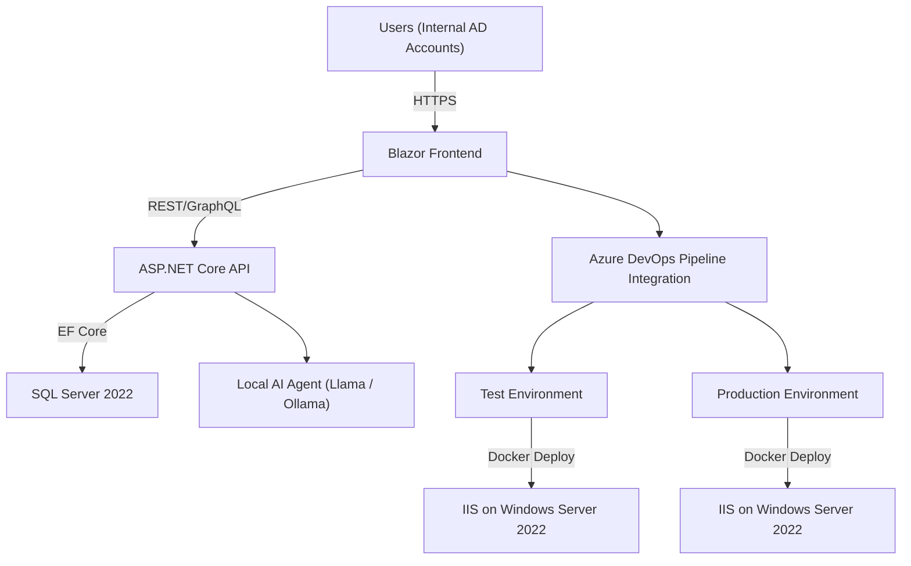

# Future State System Specification (v1)

**Author:** Mike Bender  
**Stack:** Microsoft Full Stack (Blazor, .NET 8, EF Core, SQL Server, Azure DevOps, IIS, Containers, Local AI)  
**Date:** October 2025  

---

## 1. Vision Statement
Create a fully integrated, containerized Microsoft-based application platform for internal business systems, enabling rapid deployment, maintainability, and AI-assisted automation. The solution will modernize legacy Access/SQL apps into secure, web-based applications hosted on Windows Server 2022 using IIS, backed by CI/CD pipelines in Azure DevOps and enhanced by a local AI agent using Llama.

---

## 2. System Overview
### Core Components
| Layer | Technology | Purpose |
|--------|-------------|----------|
| **Frontend** | **Blazor WebAssembly (.NET 8)** | Rich interactive web UI with C# shared logic. |
| **Backend API** | **ASP.NET Core Minimal APIs** | Lightweight, scalable REST endpoints. |
| **Database** | **SQL Server 2022** | Centralized, relational data store. |
| **ORM** | **Entity Framework Core 8** | Data access and migration management. |
| **Auth** | **Windows Authentication (Active Directory)** | Internal identity and role-based access control. |
| **Web Server** | **IIS on Windows Server 2022 (Containerized)** | Hosting environment for apps and APIs. |
| **DevOps** | **Azure DevOps Pipelines + Repos** | Source control, build, deploy on merge to main/test. |
| **AI Layer** | **Local Llama Model (via Ollama / LM Studio)** | Embedded AI assistant for code, testing, and operations. |
| **Containers** | **Docker for Windows + Compose** | Standardized app environments and scalability. |

---

## 3. Architecture Diagram

---

## 4. Security Model
- **Authentication:** Windows Authentication via Active Directory (integrated into IIS + ASP.NET Core).  
- **Authorization:** Role-based using AD groups mapped to application roles.  
- **Environment Segregation:** Test and Production on separate containers with separate service accounts.  
- **Pipeline Security:** DevOps protected branches (PR approval required for deploy).  
- **AI Access Control:** AI agent restricted to approved code directories and logs only.  

---

## 5. Deployment Workflow
| Stage | Trigger | Action | Target |
|--------|----------|---------|---------|
| **Dev** | Local Build | Developer runs container locally | Localhost Docker/IIS |
| **Test** | Merge to `test` branch | Azure DevOps builds & deploys to Test | Test Server (Container) |
| **Prod** | Merge + Approve PR to `main` | DevOps auto-deploys on approval | Production Server (Container) |

Each deployment includes:  
- Unit + Integration Tests (xUnit / MSTest)  
- Docker Build and Push  
- IIS Container Restart  
- Log Aggregation & Notification (optional PowerShell / Teams integration)

---

## 6. Local AI Agent (Llama)
### Goals
- Review C#, SQL, and Blazor code for errors and improvements.
- Propose tests and data validations.
- Summarize helpdesk tickets and automate updates.

### Architecture
| Component | Description |
|------------|--------------|
| **Ollama / LM Studio** | Runs Llama 3 locally with API access. |
| **AI Connector API** | .NET service connecting to local AI endpoint. |
| **Knowledge Base** | Uses vectorized project data and DevOps logs. |
| **Usage Examples** | “Summarize last 10 commits”, “Review recent build logs for errors.” |

---

## 7. Roadmap (Implementation Plan)
| Phase | Goal | Key Deliverables |
|--------|------|------------------|
| **Phase 1** | Core Infrastructure | Dev/Test/Prod setup, Docker, IIS, DevOps integration |
| **Phase 2** | App Migration | Migrate first Access app → Blazor + EF Core + SQL |
| **Phase 3** | AI Layer | Install Llama/Ollama, connect via .NET service |
| **Phase 4** | Monitoring & Enhancements | Add logging, backup jobs, AI-assisted support tools |
| **Phase 5** | Expansion | Add other legacy systems + automate DevOps flows |

---

## 8. Training Roadmap (Free Hands-On Tutorials)
### 1. **Blazor (.NET 8)**
- [FreeCodeCamp: Build a Full Blazor WebAssembly App (YouTube)](https://www.youtube.com/watch?v=gfI0hFdY1p8)
- [Microsoft Learn: Build a Blazor WebAssembly App](https://learn.microsoft.com/en-us/training/modules/build-blazor-webassembly-visual-studio/)

### 2. **ASP.NET Core APIs + EF Core**
- [Code Maze: ASP.NET Core Web API + EF Core Tutorial](https://code-maze.com/aspnetcore-webapi-efcore/)
- [Microsoft Learn: Work with Data in EF Core](https://learn.microsoft.com/en-us/training/modules/persist-data-ef-core/)

### 3. **SQL Server + Docker Setup**
- [Microsoft Docs: SQL Server Containers on Windows](https://learn.microsoft.com/en-us/sql/linux/sql-server-linux-docker-container-deployment?view=sql-server-ver16)

### 4. **Azure DevOps Pipelines + CI/CD**
- [Microsoft Learn: Build ASP.NET Core Apps with Azure Pipelines](https://learn.microsoft.com/en-us/training/modules/build-app-with-pipelines/)
- [YouTube: DevOps CI/CD for ASP.NET Apps](https://www.youtube.com/watch?v=Rg2mA9ZuHhA)

### 5. **Docker on Windows + IIS Containers**
- [Microsoft Learn: Docker for .NET Developers](https://learn.microsoft.com/en-us/dotnet/architecture/microservices/container-docker-introduction/)
- [YouTube: Host ASP.NET in IIS using Docker](https://www.youtube.com/watch?v=2sXKq5f8DgI)

### 6. **AI Integration (Llama / Ollama)**
- [Ollama Setup Guide](https://ollama.ai/download)
- [Local Llama 3 API Example (GitHub)](https://github.com/ollama/ollama)
- [YouTube: Run Llama 3 Locally](https://www.youtube.com/watch?v=tVYgxFtYVbE)

---

## 9. Implementation Checklist
- [ ] Setup Docker & Containers on Server 2022  
- [ ] Install SQL Server 2022 in Container  
- [ ] Configure IIS + ASP.NET Core Hosting Bundle  
- [ ] Create Azure DevOps Repo + Pipeline Templates  
- [ ] Setup Branch Policy (Dev → Test → Prod)  
- [ ] Create First Blazor + .NET Core + EF Project  
- [ ] Configure AD Authentication  
- [ ] Integrate Local Llama AI Agent  
- [ ] Automate Build/Deploy with Docker + DevOps  
- [ ] Document AI Feedback Workflow

---

## 10. Next Steps
1. Finalize environment specs for your local test VM.  
2. Create initial container templates (SQL, IIS, .NET API).  
3. Deploy base Blazor app with AD login.  
4. Begin training on Blazor and DevOps pipelines.  
5. Integrate AI agent for log/code review in Phase 3.

---

**End of Document — v1.0**

